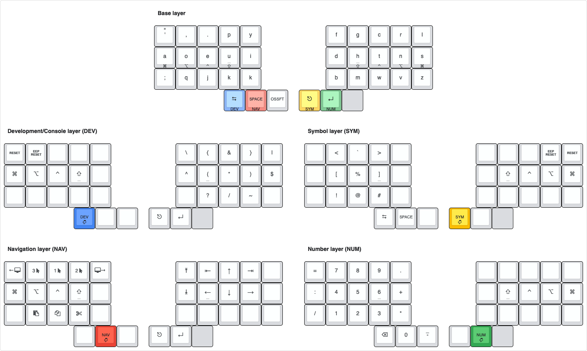

# My keyboard layout for the [Skeletyl](https://bastardkb.com/skeletyl/)

## Base: DVORAK with [home row mods](https://precondition.github.io/home-row-mods) and [Miryoku-inspired layers](https://github.com/manna-harbour/miryoku)

```
╭────────┬────────┬────────┬────────┬────────╮ ╭────────┬────────┬────────┬────────┬────────╮
│   ' "  │    ,   │    .   │    p   │    y   │ │    f   │    g   │    c   │    r   │    l   │
├────────┼────────┼────────┼────────┼────────┤ ├────────┼────────┼────────┼────────┼────────┤
│ Gui(a) │ Alt(o) │ Ctl(e) │Shift(u)│    i   │ │    d   │Shift(h)│ Ctl(t) │ Alt(n) │ Gui(s) │
├────────┼────────┼────────┼────────┼────────┤ ├────────┼────────┼────────┼────────┼────────┤
│    ;   │    q   │    j   │    k   │    x   │ │    b   │    m   │    w   │    v   │    z   │
╰────────┴────────┼────────┼────────┼────────┤ ├────────┼────────┼────────┼────────┴────────╯
                  │Dev(Tab)│Nav(Spc)│OSM(Sft)│ │Sym(Esc)│Num(Ent)│        │
                  ╰────────┴────────┴────────╯ ╰────────┴────────┴────────╯
```

## 1: Dev/Term symbols

```
╭────────┬────────┬────────┬────────┬────────╮ ╭────────┬────────┬────────┬────────┬────────╮
│  Reset │Rst(EEP)│        │        │        │ │    \   │    {   │    &   │    }   │    |   │
├────────┼────────┼────────┼────────┼────────┤ ├────────┼────────┼────────┼────────┼────────┤
│   Gui  │   Alt  │   Ctl  │  Shift │        │ │    ^   │    (   │    *   │    )   │    $   │
├────────┼────────┼────────┼────────┼────────┤ ├────────┼────────┼────────┼────────┼────────┤
│        │        │        │        │        │ │        │    ?   │    /   │    ~   │        │
╰────────┴────────┼────────┼────────┼────────┤ ├────────┼────────┼────────┼────────┴────────╯
                  │Dev(Tab)│        │        │ │   Esc  │  Enter │        │
                  ╰────────┴────────┴────────╯ ╰────────┴────────┴────────╯
```

## 3: Navigation

```
╭────────┬────────┬────────┬────────┬────────╮ ╭────────┬────────┬────────┬────────┬────────╮
│Screen ←│ Mouse3 │ Mouse1 │ Mouse2 │Screen →│ │  PgUp  │  Home  │    ↑   │   End  │        │
├────────┼────────┼────────┼────────┼────────┤ ├────────┼────────┼────────┼────────┼────────┤
│   Gui  │   Alt  │   Ctl  │  Shift │        │ │ PgDown │    ←   │    ↓   │    →   │        │
├────────┼────────┼────────┼────────┼────────┤ ├────────┼────────┼────────┼────────┼────────┤
│        │  Paste │  Copy  │   Cut  │        │ │        │        │        │        │        │
╰────────┴────────┼────────┼────────┼────────┤ ├────────┼────────┼────────┼────────┴────────╯
                  │        │Nav(Spc)│        │ │   Esc  │  Enter │        │
                  ╰────────┴────────┴────────╯ ╰────────┴────────┴────────╯
```

## 3: Numpad

```
╭────────┬────────┬────────┬────────┬────────╮ ╭────────┬────────┬────────┬────────┬────────╮
│    =   │    7   │    8   │    9   │    .   │ │        │        │        │        │        │
├────────┼────────┼────────┼────────┼────────┤ ├────────┼────────┼────────┼────────┼────────┤
│    :   │    4   │    5   │    6   │    +   │ │        │  Shift │   Ctl  │   Alt  │   Gui  │
├────────┼────────┼────────┼────────┼────────┤ ├────────┼────────┼────────┼────────┼────────┤
│    /   │    1   │    2   │    3   │    *   │ │        │        │        │        │        │
╰────────┴────────┼────────┼────────┼────────┤ ├────────┼────────┼────────┼────────┴────────╯
                  │ BckSpc │    0   │   - _  │ │        │Num(Ent)│        │
                  ╰────────┴────────┴────────╯ ╰────────┴────────┴────────╯
```

## 4: Other symbols

```
╭────────┬────────┬────────┬────────┬────────╮ ╭────────┬────────┬────────┬────────┬────────╮
│        │    <   │    `   │    >   │        │ │        │        │        │Rst(EEP)│  Reset │
├────────┼────────┼────────┼────────┼────────┤ ├────────┼────────┼────────┼────────┼────────┤
│        │    [   │    %   │    ]   │        │ │        │  Shift │   Ctl  │   Alt  │   Gui  │
├────────┼────────┼────────┼────────┼────────┤ ├────────┼────────┼────────┼────────┼────────┤
│        │    !   │    @   │    #   │        │ │        │        │        │        │        │
╰────────┴────────┼────────┼────────┼────────┤ ├────────┼────────┼────────┼────────┴────────╯
                  │   Tab  │   Spc  │        │ │Sym(Esc)│        │        │
                  ╰────────┴────────┴────────╯ ╰────────┴────────┴────────╯

```

## Keymap Layout (generated with keyboard-layout-editor.com)


