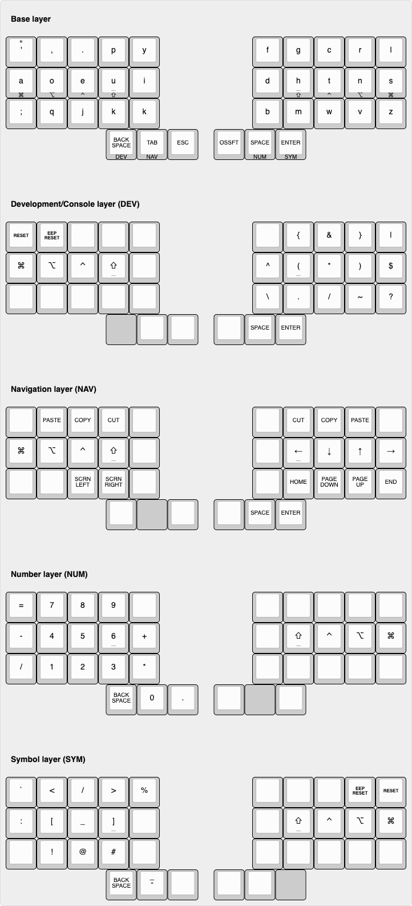

# My keyboard layout for the [TBK Mini](https://bastardkb.com/keebs/)

## Base: DVORAK with [home row mods](https://precondition.github.io/home-row-mods) and [Miryoku-inspired layers](https://github.com/manna-harbour/miryoku)

```
╭────────┬────────┬────────┬────────┬────────┬────────╮ ╭────────┬────────┬────────┬────────┬────────┬────────╮
│        │   ' "  │    ,   │    .   │    p   │    y   │ │    f   │    g   │    c   │    r   │    l   │        │
├────────┼────────┼────────┼────────┼────────┼────────┤ ├────────┼────────┼────────┼────────┼────────┼────────┤
│        │ Gui(a) │ Alt(o) │ Ctl(e) │Shift(u)│    i   │ │    d   │Shift(h)│ Ctl(t) │ Alt(n) │ Gui(s) │        │
├────────┼────────┼────────┼────────┼────────┼────────┤ ├────────┼────────┼────────┼────────┼────────┼────────┤
│        │    ;   │    q   │    j   │    k   │    x   │ │    b   │    m   │    w   │    v   │    z   │        │
╰────────┴────────┴────────┼────────┼────────┼────────┤ ├────────┼────────┼────────┼────────┴────────┴────────╯
                           │Dev(Bsp)│Nav(Tab)│   Esc  │ │OSM(Sft)│Num(Spc)│Sym(Ent)│
                           ╰────────┴────────┴────────╯ ╰────────┴────────┴────────╯
```

## 1: Dev/Term symbols

```
╭────────┬────────┬────────┬────────┬────────┬────────╮ ╭────────┬────────┬────────┬────────┬────────┬────────╮
│        │  Reset │Rst(EEP)│        │        │        │ │        │    {   │    &   │    }   │    |   │        │
├────────┼────────┼────────┼────────┼────────┼────────┤ ├────────┼────────┼────────┼────────┼────────┼────────┤
│        │   Gui  │   Alt  │   Ctl  │  Shift │        │ │    ^   │    (   │    *   │    )   │    $   │        │
├────────┼────────┼────────┼────────┼────────┼────────┤ ├────────┼────────┼────────┼────────┼────────┼────────┤
│        │        │        │        │        │        │ │    \   │    .   │    /   │    ~   │    ?   │        │
╰────────┴────────┴────────┼────────┼────────┼────────┤ ├────────┼────────┼────────┼────────┴────────┴────────╯
                           │Dev(Bsp)│        │        │ │        │  Space │  Enter │
                           ╰────────┴────────┴────────╯ ╰────────┴────────┴────────╯
```

## 3: Navigation

```
╭────────┬────────┬────────┬────────┬────────┬────────╮ ╭────────┬────────┬────────┬────────┬────────┬────────╮
│        │        │  Paste │  Copy  │   Cut  │        │ │        │   Cut  │  Copy  │  Paste │        │        │
├────────┼────────┼────────┼────────┼────────┼────────┤ ├────────┼────────┼────────┼────────┼────────┼────────┤
│        │   Gui  │   Alt  │   Ctl  │  Shift │        │ │        │    ←   │    ↓   │    ↑   │    →   │        │
├────────┼────────┼────────┼────────┼────────┼────────┤ ├────────┼────────┼────────┼────────┼────────┼────────┤
│        │        │        │Screen ←│Screen →│        │ │        │  Home  │ PgDown │  PgUp  │   End  │        │
╰────────┴────────┴────────┼────────┼────────┼────────┤ ├────────┼────────┼────────┼────────┴────────┴────────╯
                           │        │Nav(Tab)│        │ │        │  Space │  Enter │
                           ╰────────┴────────┴────────╯ ╰────────┴────────┴────────╯
```

## 3: Numpad

```
╭────────┬────────┬────────┬────────┬────────┬────────╮ ╭────────┬────────┬────────┬────────┬────────┬────────╮
│        │    =   │    7   │    8   │    9   │        │ │        │        │        │        │        │        │
├────────┼────────┼────────┼────────┼────────┼────────┤ ├────────┼────────┼────────┼────────┼────────┼────────┤
│        │    -   │    4   │    5   │    6   │    +   │ │        │  Shift │   Ctl  │   Alt  │   Gui  │        │
├────────┼────────┼────────┼────────┼────────┼────────┤ ├────────┼────────┼────────┼────────┼────────┼────────┤
│        │    /   │    1   │    2   │    3   │    *   │ │        │        │        │        │        │        │
╰────────┴────────┴────────┼────────┼────────┼────────┤ ├────────┼────────┼────────┼────────┴────────┴────────╯
                           │ BckSpc │    0   │    .   │ │        │Num(Spc)│        │
                           ╰────────┴────────┴────────╯ ╰────────┴────────┴────────╯
```

## 4: Other symbols

```
╭────────┬────────┬────────┬────────┬────────┬────────╮ ╭────────┬────────┬────────┬────────┬────────┬────────╮
│        │    `   │    <   │    /   │    >   │    %   │ │        │        │        │Rst(EEP)│  Reset │        │
├────────┼────────┼────────┼────────┼────────┼────────┤ ├────────┼────────┼────────┼────────┼────────┼────────┤
│        │    :   │    [   │    _   │    ]   │        │ │        │  Shift │   Ctl  │   Alt  │   Gui  │        │
├────────┼────────┼────────┼────────┼────────┼────────┤ ├────────┼────────┼────────┼────────┼────────┼────────┤
│        │        │    !   │    @   │    #   │        │ │        │        │        │        │        │        │
╰────────┴────────┴────────┼────────┼────────┼────────┤ ├────────┼────────┼────────┼────────┴────────┴────────╯
                           │ BckSpc │   - _  │        │ │        │        │Sym(Ent)│
                           ╰────────┴────────┴────────╯ ╰────────┴────────┴────────╯

```

## Keymap Layout (generated with keyboard-layout-editor.com)


